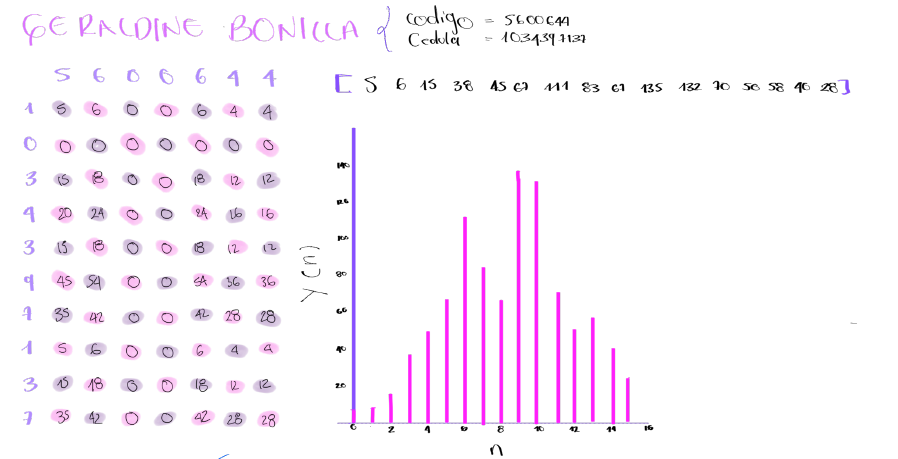
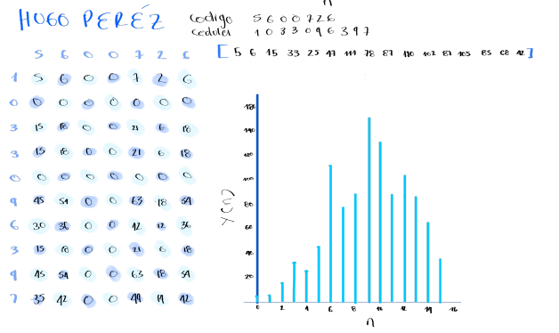
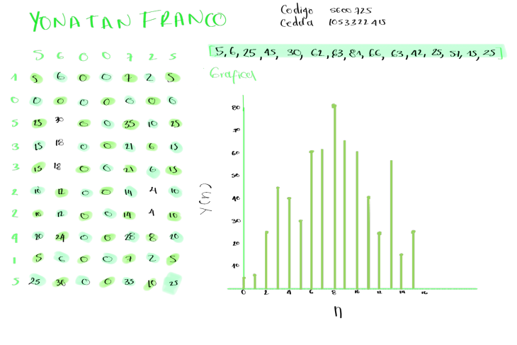
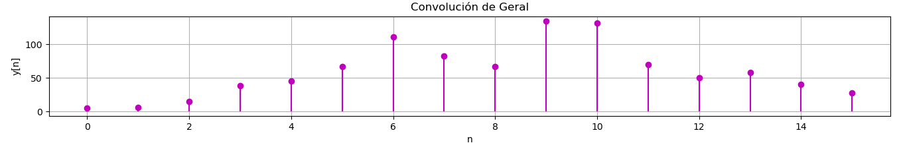
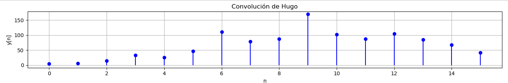
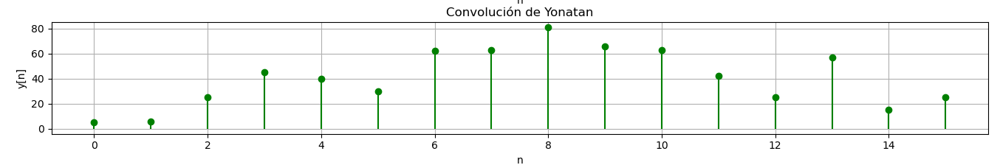
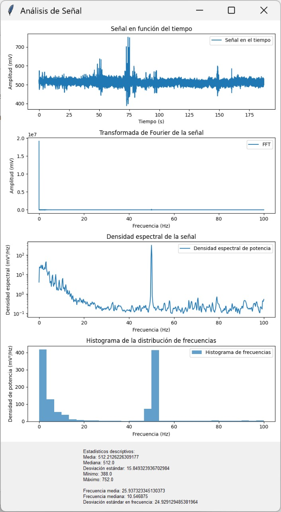

# LAB2 PDS Convolución y Correlación 

## Introducción  
El objetivo segunda entrega del laboratorio es crear un código en Python para analizar y entender conceptos fundamentales del Procesamiento Digital de Señales, tales como la convolución, la correlación y, además, la transformada de Fourier para el análisis en el dominio de la frecuencia.

## Convolución 
La primera parte del laboratorio se basa en encontrar la convolución y la representación gráfica y secuencial de un sistema h(n) y una señal x(n) utilizando sumatorias y con programando a través de Python.

Para la convolución utilizamos como sistema el código estudiantil de cada uno de los 3 integrantes del laboratorio y  como señal el número de sus cédulas, de esta manera calculamos la convolución. Primero de forma manual usando sumatorias, para esto utilizamos una matriz donde multiplicamos de cada dígito de las columnas por los dígitos de las columnas y luego súmanos todos los valores en diagonal para finalmente hallar el vector para cada no de los estudiantes de la siguiente manera:

Para cada caso:

-Greraldine resultado de esta convulucion seria h(n) x X(n)=[5,6,38,45,67,111,83,67,135,70,50,58,40,28]



-Hugo resultado de esta convulucion seria h(n) x X(n)=[5,6,15,33,25,447,111,78,87,170,102,87,105,85,68,42]



-Yonatan resultado de esta convulucion seria h(n) x X(n)=[5,6,25,45,30,62,63,81,66,63,42,25,57,15,25]


Luego de tener estos datos por medio de calculculos hechos a mano procedemos acomparar con los resultudado de la convulucion  con la de los codigos hechos con pyton. 

Para esto se definen los sistemas y señales asignados por el codigo estudiantil y la cedula.

```python
hugo_h = np.array([5, 6, 0, 0, 7, 2, 6])
hugo_x = np.array([1, 0, 3, 3, 0, 9, 6, 3, 9, 7])

geral_h = np.array([5, 6, 0, 0, 6, 4, 4])
geral_x = np.array([1, 0, 3, 4, 3, 9, 7, 1, 3, 7])

yonatan_h = np.array([5, 6, 0, 0, 7, 2, 5])
yonatan_x = np.array([1, 0, 5, 3, 3, 2, 2, 4, 1, 5])
```

Una vez los sistemas y la señal definida utilizamos numpy que se encargada de el calculo numerico, arreglos y operacione, de estas operaciones utilizamos np.convolve(x,h) que toma los arreglos x y h y calcula su convulución devolviendo un nuevo arrgelo "y" que representa la salida de un sistema lienal con "h" y como la respuesta impulso cuando recibe "x" como entrada.

```python
hugo_y = np.convolve(hugo_x, hugo_h)
geral_y = np.convolve(geral_x, geral_h)
yonatan_y = np.convolve(yonatan_x, yonatan_h) 
```

Convpñución realizada por Python para cada uno de los casos 
Geraldine Bonilla h(n) x X(n)=[5,6,38,45,67,111,83,67,135,70,50,58,40,28]


Hugo Alejandro Peréz h(n) x X(n)=[5,6,15,33,25,447,111,78,87,170,102,87,105,85,68,42]


Yonatan Ivan Franco h(n) x X(n)=[5,6,25,45,30,62,63,81,66,63,42,25,57,15,25]


## Correlación 
En la segunda parte del laboratorio, se desarrolla con dos señales dadas  discretas la correlación que es una operación entre señales la cual nos indicará cuánto se parece una señal a la otra cuando una de ellas se desplaza en el tiempo. 
Se definio en python los parametros el tiempo de muestro y el dominio de la señales discretas; así como también se plantean las señales dadas de la guia.

 ```python
Ts = 1.25e-3  
n = np.arange(0, 9)  

x1 = np.cos(2 * np.pi * 100 * n * Ts)
x2 = np.sin(2 * np.pi * 100 * n * Ts)
```
Se calcula de forma secuencial teniendo en cuenta los parametros anteriores, obtenemos los siguientes valores x1[nTs]


Y para la señal x2[nTs] 


Se logra la representación gráfica, donde podemos ver señales que depende de n y son señales discretas 

[](https://postimg.cc/JGQJsYdF)
Para determinar la correlación se usa la función de la libreria numpy correlate la cual nos permitirá calcular la correlación de manera sencilla
```python
correlacion = np.correlate(x1, x2, mode='full')
```


## Transformada de Fourier 
###  Señal Electroencefalografica EEG
Para la tercera parte del laboratorio utilizamos una señal de EEG con la finalidad de analizar esta señal en el dominio del tiempo y la frecuencia analizando sus estadísticos descriptivos, frecuencia de muestreo y aplicar la transformada de Fourier. 

# LAB2 PDS Convolución y Correlación 

## Introducción  
El objetivo segunda entrega del laboratorio es crear un código en Python para analizar y entender conceptos fundamentales del Procesamiento Digital de Señales, tales como la convolución, la correlación y, además, la transformada de Fourier para el análisis en el dominio de la frecuencia.

## Convolución 
La primera parte del laboratorio se basa en encontrar la convolución y la representación gráfica y secuencial de un sistema h(n) y una señal x(n) utilizando sumatorias y con programando a través de Python.

Para la convolución utilizamos como sistema el código estudiantil de cada uno de los 3 integrantes del laboratorio y  como señal el número de sus cédulas, de esta manera calculamos la convolución. Primero de forma manual usando sumatorias, para esto utilizamos una matriz donde multiplicamos de cada dígito de las columnas por los dígitos de las columnas y luego súmanos todos los valores en diagonal para finalmente hallar el vector para cada no de los estudiantes de la siguiente manera:

Para cada caso:

-Greraldine resultado de esta convulucion seria h(n) x X(n)=[5,6,38,45,67,111,83,67,135,70,50,58,40,28]


-Hugo resultado de esta convulucion seria h(n) x X(n)=[5,6,15,33,25,447,111,78,87,170,102,87,105,85,68,42]


-Yonatan resultado de esta convulucion seria h(n) x X(n)=[5,6,25,45,30,62,63,81,66,63,42,25,57,15,25]


Luego de tener estos datos por medio de calculculos hechos a mano procedemos acomparar con los resultudado de la convulucion  con la de los codigos hechos con pyton. 

Para esto se definen los sistemas y señales asignados por el codigo estudiantil y la cedula.

```python
hugo_h = np.array([5, 6, 0, 0, 7, 2, 6])
hugo_x = np.array([1, 0, 3, 3, 0, 9, 6, 3, 9, 7])

geral_h = np.array([5, 6, 0, 0, 6, 4, 4])
geral_x = np.array([1, 0, 3, 4, 3, 9, 7, 1, 3, 7])

yonatan_h = np.array([5, 6, 0, 0, 7, 2, 5])
yonatan_x = np.array([1, 0, 5, 3, 3, 2, 2, 4, 1, 5])
```

Una vez los sistemas y la señal definida utilizamos numpy que se encargada de el calculo numerico, arreglos y operacione, de estas operaciones utilizamos np.convolve(x,h) que toma los arreglos x y h y calcula su convulución devolviendo un nuevo arrgelo "y" que representa la salida de un sistema lienal con "h" y como la respuesta impulso cuando recibe "x" como entrada.

```python
hugo_y = np.convolve(hugo_x, hugo_h)
geral_y = np.convolve(geral_x, geral_h)
yonatan_y = np.convolve(yonatan_x, yonatan_h) 
```

Convpñución realizada por Python para cada uno de los casos 
Geraldine Bonilla h(n) x X(n)=[5,6,38,45,67,111,83,67,135,70,50,58,40,28]


Hugo Alejandro Peréz h(n) x X(n)=[5,6,15,33,25,447,111,78,87,170,102,87,105,85,68,42]


Yonatan Ivan Franco h(n) x X(n)=[5,6,25,45,30,62,63,81,66,63,42,25,57,15,25]


## Correlación 
En la segunda parte del laboratorio, se desarrolla con dos señales dadas  discretas la correlación que es una operación entre señales la cual nos indicará cuánto se parece una señal a la otra cuando una de ellas se desplaza en el tiempo. 
Se definio en python los parametros el tiempo de muestro y el dominio de la señales discretas; así como también se plantean las señales dadas de la guia.

 ```python
Ts = 1.25e-3  
n = np.arange(0, 9)  

x1 = np.cos(2 * np.pi * 100 * n * Ts)
x2 = np.sin(2 * np.pi * 100 * n * Ts)
```
Se calcula de forma secuencial teniendo en cuenta los parametros anteriores, obtenemos los siguientes valores x1[nTs]


Y para la señal x2[nTs] 


Se logra la representación gráfica, donde podemos ver señales que depende de n y son señales discretas 

[](https://postimg.cc/JGQJsYdF)
Para determinar la correlación se usa la función de la libreria numpy correlate la cual nos permitirá calcular la correlación de manera sencilla
```python
correlacion = np.correlate(x1, x2, mode='full')
```


## Transformada de Fourier 
###  Señal Electroencefalografica EEG
Para la tercera parte del laboratorio utilizamos una señal de EEG con la finalidad de analizar esta señal en el dominio del tiempo y la frecuencia analizando sus estadísticos descriptivos, frecuencia de muestreo y aplicar la transformada de Fourier. 

# LAB2 PDS Convolución y Correlación 

## Introducción  
El objetivo segunda entrega del laboratorio es crear un código en Python para analizar y entender conceptos fundamentales del Procesamiento Digital de Señales, tales como la convolución, la correlación y, además, la transformada de Fourier para el análisis en el dominio de la frecuencia.

## Convolución 
La primera parte del laboratorio se basa en encontrar la convolución y la representación gráfica y secuencial de un sistema h(n) y una señal x(n) utilizando sumatorias y con programando a través de Python.

Para la convolución utilizamos como sistema el código estudiantil de cada uno de los 3 integrantes del laboratorio y  como señal el número de sus cédulas, de esta manera calculamos la convolución. Primero de forma manual usando sumatorias, para esto utilizamos una matriz donde multiplicamos de cada dígito de las columnas por los dígitos de las columnas y luego súmanos todos los valores en diagonal para finalmente hallar el vector para cada no de los estudiantes de la siguiente manera:

Para cada caso:

-Greraldine resultado de esta convulucion seria h(n) x X(n)=[5,6,38,45,67,111,83,67,135,70,50,58,40,28]


-Hugo resultado de esta convulucion seria h(n) x X(n)=[5,6,15,33,25,447,111,78,87,170,102,87,105,85,68,42]


-Yonatan resultado de esta convulucion seria h(n) x X(n)=[5,6,25,45,30,62,63,81,66,63,42,25,57,15,25]


Luego de tener estos datos por medio de calculculos hechos a mano procedemos acomparar con los resultudado de la convulucion  con la de los codigos hechos con pyton. 

Para esto se definen los sistemas y señales asignados por el codigo estudiantil y la cedula.

```python
hugo_h = np.array([5, 6, 0, 0, 7, 2, 6])
hugo_x = np.array([1, 0, 3, 3, 0, 9, 6, 3, 9, 7])

geral_h = np.array([5, 6, 0, 0, 6, 4, 4])
geral_x = np.array([1, 0, 3, 4, 3, 9, 7, 1, 3, 7])

yonatan_h = np.array([5, 6, 0, 0, 7, 2, 5])
yonatan_x = np.array([1, 0, 5, 3, 3, 2, 2, 4, 1, 5])
```

Una vez los sistemas y la señal definida utilizamos numpy que se encargada de el calculo numerico, arreglos y operacione, de estas operaciones utilizamos np.convolve(x,h) que toma los arreglos x y h y calcula su convulución devolviendo un nuevo arrgelo "y" que representa la salida de un sistema lienal con "h" y como la respuesta impulso cuando recibe "x" como entrada.

```python
hugo_y = np.convolve(hugo_x, hugo_h)
geral_y = np.convolve(geral_x, geral_h)
yonatan_y = np.convolve(yonatan_x, yonatan_h) 
```

Convpñución realizada por Python para cada uno de los casos 
Geraldine Bonilla h(n) x X(n)=[5,6,38,45,67,111,83,67,135,70,50,58,40,28]


Hugo Alejandro Peréz h(n) x X(n)=[5,6,15,33,25,447,111,78,87,170,102,87,105,85,68,42]


Yonatan Ivan Franco h(n) x X(n)=[5,6,25,45,30,62,63,81,66,63,42,25,57,15,25]


## Correlación 
En la segunda parte del laboratorio, se desarrolla con dos señales dadas  discretas la correlación que es una operación entre señales la cual nos indicará cuánto se parece una señal a la otra cuando una de ellas se desplaza en el tiempo. 
Se definio en python los parametros el tiempo de muestro y el dominio de la señales discretas; así como también se plantean las señales dadas de la guia.

 ```python
Ts = 1.25e-3  
n = np.arange(0, 9)  

x1 = np.cos(2 * np.pi * 100 * n * Ts)
x2 = np.sin(2 * np.pi * 100 * n * Ts)
```
Se calcula de forma secuencial teniendo en cuenta los parametros anteriores, obtenemos los siguientes valores x1[nTs]


Y para la señal x2[nTs] 


Se logra la representación gráfica, donde podemos ver señales que depende de n y son señales discretas 

[](https://postimg.cc/JGQJsYdF)
Para determinar la correlación se usa la función de la libreria numpy correlate la cual nos permitirá calcular la correlación de manera sencilla
```python
correlacion = np.correlate(x1, x2, mode='full')
```


## Transformada de Fourier 
###  Señal Electroencefalografica EEG
Para la tercera parte del laboratorio utilizamos una señal de EEG con la finalidad de analizar esta señal en el dominio del tiempo y la frecuencia analizando sus estadísticos descriptivos, frecuencia de muestreo y aplicar la transformada de Fourier. 

# LAB2 PDS Convolución y Correlación 

## Introducción  
El objetivo segunda entrega del laboratorio es crear un código en Python para analizar y entender conceptos fundamentales del Procesamiento Digital de Señales, tales como la convolución, la correlación y, además, la transformada de Fourier para el análisis en el dominio de la frecuencia.

## Convolución 
La primera parte del laboratorio se basa en encontrar la convolución y la representación gráfica y secuencial de un sistema h(n) y una señal x(n) utilizando sumatorias y con programando a través de Python.

Para la convolución utilizamos como sistema el código estudiantil de cada uno de los 3 integrantes del laboratorio y  como señal el número de sus cédulas, de esta manera calculamos la convolución. Primero de forma manual usando sumatorias, para esto utilizamos una matriz donde multiplicamos de cada dígito de las columnas por los dígitos de las columnas y luego súmanos todos los valores en diagonal para finalmente hallar el vector para cada no de los estudiantes de la siguiente manera:

Para cada caso:

-Greraldine resultado de esta convulucion seria h(n) x X(n)=[5,6,38,45,67,111,83,67,135,70,50,58,40,28]


-Hugo resultado de esta convulucion seria h(n) x X(n)=[5,6,15,33,25,447,111,78,87,170,102,87,105,85,68,42]


-Yonatan resultado de esta convulucion seria h(n) x X(n)=[5,6,25,45,30,62,63,81,66,63,42,25,57,15,25]


Luego de tener estos datos por medio de calculculos hechos a mano procedemos acomparar con los resultudado de la convulucion  con la de los codigos hechos con pyton. 

Para esto se definen los sistemas y señales asignados por el codigo estudiantil y la cedula.

```python
hugo_h = np.array([5, 6, 0, 0, 7, 2, 6])
hugo_x = np.array([1, 0, 3, 3, 0, 9, 6, 3, 9, 7])

geral_h = np.array([5, 6, 0, 0, 6, 4, 4])
geral_x = np.array([1, 0, 3, 4, 3, 9, 7, 1, 3, 7])

yonatan_h = np.array([5, 6, 0, 0, 7, 2, 5])
yonatan_x = np.array([1, 0, 5, 3, 3, 2, 2, 4, 1, 5])
```

Una vez los sistemas y la señal definida utilizamos numpy que se encargada de el calculo numerico, arreglos y operacione, de estas operaciones utilizamos np.convolve(x,h) que toma los arreglos x y h y calcula su convulución devolviendo un nuevo arrgelo "y" que representa la salida de un sistema lienal con "h" y como la respuesta impulso cuando recibe "x" como entrada.

```python
hugo_y = np.convolve(hugo_x, hugo_h)
geral_y = np.convolve(geral_x, geral_h)
yonatan_y = np.convolve(yonatan_x, yonatan_h) 
```

Convpñución realizada por Python para cada uno de los casos 
Geraldine Bonilla h(n) x X(n)=[5,6,38,45,67,111,83,67,135,70,50,58,40,28]


Hugo Alejandro Peréz h(n) x X(n)=[5,6,15,33,25,447,111,78,87,170,102,87,105,85,68,42]


Yonatan Ivan Franco h(n) x X(n)=[5,6,25,45,30,62,63,81,66,63,42,25,57,15,25]


## Correlación 
En la segunda parte del laboratorio, se desarrolla con dos señales dadas  discretas la correlación que es una operación entre señales la cual nos indicará cuánto se parece una señal a la otra cuando una de ellas se desplaza en el tiempo. 
Se definio en python los parametros el tiempo de muestro y el dominio de la señales discretas; así como también se plantean las señales dadas de la guia.

 ```python
Ts = 1.25e-3  
n = np.arange(0, 9)  

x1 = np.cos(2 * np.pi * 100 * n * Ts)
x2 = np.sin(2 * np.pi * 100 * n * Ts)
```
Se calcula de forma secuencial teniendo en cuenta los parametros anteriores, obtenemos los siguientes valores x1[nTs]


Y para la señal x2[nTs] 


Se logra la representación gráfica, donde podemos ver señales que depende de n y son señales discretas 

[](https://postimg.cc/JGQJsYdF)
Para determinar la correlación se usa la función de la libreria numpy correlate la cual nos permitirá calcular la correlación de manera sencilla
```python
correlacion = np.correlate(x1, x2, mode='full')
```


## Transformada de Fourier 
###  Señal Electroencefalografica EEG
Para la tercera parte del laboratorio utilizamos una señal de EEG con la finalidad de analizar esta señal en el dominio del tiempo y la frecuencia analizando sus estadísticos descriptivos, frecuencia de muestreo y aplicar la transformada de Fourier. 

Esta señal fue descargada de "Auditory evoked potential EEG-Biometric dataset" el cual es un estudio de PhysioNet. El cual estudia señales EEG de 20 voluntarios con diferentes condiciones experimentales con el objetivo de recopilar datos para el desarrollo de un sistema biométrico sobre EEG y a su vez estudia la respuesta del cerebro  a estímulos auditivos y a la comparación entre estados de reposo con ojos abiertos y cerrados

Una vez obtenida la señal el primer paso es cargar la señal, para esto se usa la librería "wfdb" la cual permite manejar las señales biomédicas con en este caso la EEG y se obtiene la frecuencia de muestreo.

```python

import wfdb
record_name = r"C:\Users\alejo\Desktop\señales\Lab 2\s01_ex01_s02"
record = wfdb.rdrecord(record_name)
signal = record.p_signal[:, 0]  # Primera señal (asumiendo una sola)
fs = record.fs  # Frecuencia de muestreo

```
Una vez procesada la señal se utilizo  "Numpy" para el calculo de estadisticas descriptivas de la señal, como la media, la mediana y la desviación estandar.
```python

def estadisticos_descriptivos(signal):
    return {
        "Media": np.mean(signal),
        "Mediana": np.median(signal),
        "Desviación estándar": np.std(signal),
        "Mínimo": np.min(signal),
        "Máximo": np.max(signal)
    }

descriptive_stats = estadisticos_descriptivos(signal)

```
Para el calculo de la transformada de Fourier se utilizo "fft(signal)" la cual tranforma la selak del dominio del tiempo al domino de la frecuencia.

```python
from scipy.fftpack import fft
N = len(signal)
frequencies = np.fft.fftfreq(N, 1/fs)
fft_values = fft(signal)
```

Para el caculo de densidad espectral de potencia (PDS) utilizamos el método Welch muestra como la energía de la señal se distribuye en diferentes frecuencias. 

```python
from scipy.signal import welch
freqs, psd = welch(signal, fs, nperseg=1024)

```
El siguiente paso fue calcular las estadísticas en el dominio de la frecuencia, como la frecuencia media, la frecuencia media y la desviación estándar den frecuencia
```python

frecuencia_media = np.sum(freqs * psd) / np.sum(psd)
frecuencia_mediana = freqs[np.searchsorted(np.cumsum(psd), np.sum(psd) / 2)]
desviacion_estandar = np.sqrt(np.sum(psd * (freqs - frecuencia_media) ** 2) / np.sum(psd))
```


Finalmente, "Matplotlib"  graficamos:
 1) La señal en el dominio del tiempo

 2) FFT transformada de Fourier

 3) PSD distribución de la potencia en frecuencia

 4) Histograma de la distribución de  frecuencias
    


```python
fig, axs = plt.subplots(4, 1, figsize=(8, 12))

# Señal en función del tiempo
time = np.arange(len(signal)) / fs
axs[0].plot(time, signal, label='Señal en el tiempo')

# Transformada de Fourier
axs[1].plot(frequencies[:N//2], np.abs(fft_values[:N//2]), label='FFT')

# Densidad espectral de potencia
axs[2].semilogy(freqs, psd, label='Densidad espectral de potencia')

# Histograma de frecuencias
axs[3].hist(freqs, bins=30, weights=psd, alpha=0.7, label='Histograma de frecuencias')

fig.tight_layout()

```


### Contact information
est.nikoll.bonilla@unimilitar.edu.co

est.hugo.perez@unimilitar.edu.co

est.yonatan.franco@unimilitar.edu.co

Una vez obtenida la señal el primer paso es cargar la señal, para esto se usa la librería "wfdb" la cual permite manejar las señales biomédicas con en este caso la EEG y se obtiene la frecuencia de muestreo.

```python

import wfdb
record_name = r"C:\Users\alejo\Desktop\señales\Lab 2\s01_ex01_s02"
record = wfdb.rdrecord(record_name)
signal = record.p_signal[:, 0]  # Primera señal (asumiendo una sola)
fs = record.fs  # Frecuencia de muestreo

```
Una vez procesada la señal se utilizo  "Numpy" para el calculo de estadisticas descriptivas de la señal, como la media, la mediana y la desviación estandar.
```python

def estadisticos_descriptivos(signal):
    return {
        "Media": np.mean(signal),
        "Mediana": np.median(signal),
        "Desviación estándar": np.std(signal),
        "Mínimo": np.min(signal),
        "Máximo": np.max(signal)
    }

descriptive_stats = estadisticos_descriptivos(signal)

```
Para el calculo de la transformada de Fourier se utilizo "fft(signal)" la cual tranforma la selak del dominio del tiempo al domino de la frecuencia.

```python
from scipy.fftpack import fft
N = len(signal)
frequencies = np.fft.fftfreq(N, 1/fs)
fft_values = fft(signal)
```

Para el caculo de densidad espectral de potencia (PDS) utilizamos el método Welch muestra como la energía de la señal se distribuye en diferentes frecuencias. 

```python
from scipy.signal import welch
freqs, psd = welch(signal, fs, nperseg=1024)

```
El siguiente paso fue calcular las estadísticas en el dominio de la frecuencia, como la frecuencia media, la frecuencia media y la desviación estándar den frecuencia
```python

frecuencia_media = np.sum(freqs * psd) / np.sum(psd)
frecuencia_mediana = freqs[np.searchsorted(np.cumsum(psd), np.sum(psd) / 2)]
desviacion_estandar = np.sqrt(np.sum(psd * (freqs - frecuencia_media) ** 2) / np.sum(psd))
```


Finalmente, "Matplotlib"  graficamos:
 1) La señal en el dominio del tiempo

 2) FFT transformada de Fourier

 3) PSD distribución de la potencia en frecuencia

 4) Histograma de la distribución de  frecuencias
    


```python
fig, axs = plt.subplots(4, 1, figsize=(8, 12))

# Señal en función del tiempo
time = np.arange(len(signal)) / fs
axs[0].plot(time, signal, label='Señal en el tiempo')

# Transformada de Fourier
axs[1].plot(frequencies[:N//2], np.abs(fft_values[:N//2]), label='FFT')

# Densidad espectral de potencia
axs[2].semilogy(freqs, psd, label='Densidad espectral de potencia')

# Histograma de frecuencias
axs[3].hist(freqs, bins=30, weights=psd, alpha=0.7, label='Histograma de frecuencias')

fig.tight_layout()

```


### Contact information
est.nikoll.bonilla@unimilitar.edu.co

est.hugo.perez@unimilitar.edu.co

est.yonatan.franco@unimilitar.edu.co

Una vez obtenida la señal el primer paso es cargar la señal, para esto se usa la librería "wfdb" la cual permite manejar las señales biomédicas con en este caso la EEG y se obtiene la frecuencia de muestreo.

```python

import wfdb
record_name = r"C:\Users\alejo\Desktop\señales\Lab 2\s01_ex01_s02"
record = wfdb.rdrecord(record_name)
signal = record.p_signal[:, 0]  # Primera señal (asumiendo una sola)
fs = record.fs  # Frecuencia de muestreo

```
Una vez procesada la señal se utilizo  "Numpy" para el calculo de estadisticas descriptivas de la señal, como la media, la mediana y la desviación estandar.
```python

def estadisticos_descriptivos(signal):
    return {
        "Media": np.mean(signal),
        "Mediana": np.median(signal),
        "Desviación estándar": np.std(signal),
        "Mínimo": np.min(signal),
        "Máximo": np.max(signal)
    }

descriptive_stats = estadisticos_descriptivos(signal)

```
Para el calculo de la transformada de Fourier se utilizo "fft(signal)" la cual tranforma la selak del dominio del tiempo al domino de la frecuencia.

```python
from scipy.fftpack import fft
N = len(signal)
frequencies = np.fft.fftfreq(N, 1/fs)
fft_values = fft(signal)
```

Para el caculo de densidad espectral de potencia (PDS) utilizamos el método Welch muestra como la energía de la señal se distribuye en diferentes frecuencias. 

```python
from scipy.signal import welch
freqs, psd = welch(signal, fs, nperseg=1024)

```
El siguiente paso fue calcular las estadísticas en el dominio de la frecuencia, como la frecuencia media, la frecuencia media y la desviación estándar den frecuencia
```python

frecuencia_media = np.sum(freqs * psd) / np.sum(psd)
frecuencia_mediana = freqs[np.searchsorted(np.cumsum(psd), np.sum(psd) / 2)]
desviacion_estandar = np.sqrt(np.sum(psd * (freqs - frecuencia_media) ** 2) / np.sum(psd))
```


Finalmente, "Matplotlib"  graficamos:
 1) La señal en el dominio del tiempo

 2) FFT transformada de Fourier

 3) PSD distribución de la potencia en frecuencia

 4) Histograma de la distribución de  frecuencias
    


```python
fig, axs = plt.subplots(4, 1, figsize=(8, 12))

# Señal en función del tiempo
time = np.arange(len(signal)) / fs
axs[0].plot(time, signal, label='Señal en el tiempo')

# Transformada de Fourier
axs[1].plot(frequencies[:N//2], np.abs(fft_values[:N//2]), label='FFT')

# Densidad espectral de potencia
axs[2].semilogy(freqs, psd, label='Densidad espectral de potencia')

# Histograma de frecuencias
axs[3].hist(freqs, bins=30, weights=psd, alpha=0.7, label='Histograma de frecuencias')

fig.tight_layout()

```


### Contact information
est.nikoll.bonilla@unimilitar.edu.co

est.hugo.perez@unimilitar.edu.co

est.yonatan.franco@unimilitar.edu.co

Una vez obtenida la señal el primer paso es cargar la señal, para esto se usa la librería "wfdb" la cual permite manejar las señales biomédicas con en este caso la EEG y se obtiene la frecuencia de muestreo.

```python

import wfdb
record_name = r"C:\Users\alejo\Desktop\señales\Lab 2\s01_ex01_s02"
record = wfdb.rdrecord(record_name)
signal = record.p_signal[:, 0]  # Primera señal (asumiendo una sola)
fs = record.fs  # Frecuencia de muestreo

```
Una vez procesada la señal se utilizo  "Numpy" para el calculo de estadisticas descriptivas de la señal, como la media, la mediana y la desviación estandar.
```python

def estadisticos_descriptivos(signal):
    return {
        "Media": np.mean(signal),
        "Mediana": np.median(signal),
        "Desviación estándar": np.std(signal),
        "Mínimo": np.min(signal),
        "Máximo": np.max(signal)
    }

descriptive_stats = estadisticos_descriptivos(signal)

```
Para el calculo de la transformada de Fourier se utilizo "fft(signal)" la cual tranforma la selak del dominio del tiempo al domino de la frecuencia.

```python
from scipy.fftpack import fft
N = len(signal)
frequencies = np.fft.fftfreq(N, 1/fs)
fft_values = fft(signal)
```

Para el caculo de densidad espectral de potencia (PDS) utilizamos el método Welch muestra como la energía de la señal se distribuye en diferentes frecuencias. 

```python
from scipy.signal import welch
freqs, psd = welch(signal, fs, nperseg=1024)

```
El siguiente paso fue calcular las estadísticas en el dominio de la frecuencia, como la frecuencia media, la frecuencia media y la desviación estándar den frecuencia
```python

frecuencia_media = np.sum(freqs * psd) / np.sum(psd)
frecuencia_mediana = freqs[np.searchsorted(np.cumsum(psd), np.sum(psd) / 2)]
desviacion_estandar = np.sqrt(np.sum(psd * (freqs - frecuencia_media) ** 2) / np.sum(psd))
```


Finalmente, "Matplotlib"  graficamos:
 1) La señal en el dominio del tiempo

 2) FFT transformada de Fourier

 3) PSD distribución de la potencia en frecuencia

 4) Histograma de la distribución de  frecuencias
    


```python
fig, axs = plt.subplots(4, 1, figsize=(8, 12))

# Señal en función del tiempo
time = np.arange(len(signal)) / fs
axs[0].plot(time, signal, label='Señal en el tiempo')

# Transformada de Fourier
axs[1].plot(frequencies[:N//2], np.abs(fft_values[:N//2]), label='FFT')

# Densidad espectral de potencia
axs[2].semilogy(freqs, psd, label='Densidad espectral de potencia')

# Histograma de frecuencias
axs[3].hist(freqs, bins=30, weights=psd, alpha=0.7, label='Histograma de frecuencias')

fig.tight_layout()

```


### Contact information
est.nikoll.bonilla@unimilitar.edu.co

est.hugo.perez@unimilitar.edu.co

est.yonatan.franco@unimilitar.edu.co
