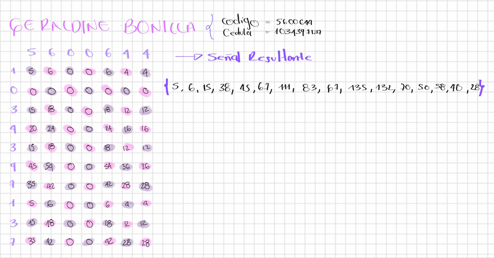

# LAB2 PDS Convulución y Correlación 

## Introducción  
El objetivo segunda entrega dell laboratorio es crear un código en Python para analizar y entender conceptos fundamentales del Procesamiento Digital de Señales, tales como la convolución, la correlación y, además, la transformada de Fourier para el análisis en el dominio de la frecuencia.

## Convolución 
La primera parte del laboratorio se basa en encontrar la convolución y la representación gráfica y secuencial de un sistema h(n) y una señal x(n) utilizando sumatorias y con programando a través de Python.

Para la convolución utilizamos como sistema el código estudiantil de cada uno de los 3 integrantes del laboratorio y  como señal el número de sus cédulas, de esta manera calculamos la convolución. Primero de forma manual usando sumatorias, para esto utilizamos una matriz donde multiplicamos de cada dígito de las columnas por los dígitos de las columnas y luego súmanos todos los valores en diagonal para finalmente hallar el vector de la siguiente manera:

el resultado de esta convulucion seria h(n) x X(n)=[5,6,15,38,45,67,111,83,67,135,70,50,58,40,28]

## Correlación 

## Transformada de Fourier 
###  Señal Electroencefalografica EEG
Para la tercera parte del laboratorio utilizamos una señal de EEG con la finalidad de analizar esta señal en el domi nio del tiempo y la freciuencia analizando sus estadisticos descriptivos, frecuencia de muestreo y aplicar la transformada de fourier . 

la señal que utilizamos fue descargada de Physionet. esta habla de un 
### Contact information
est.nikoll.bonilla@unimilitar.edu.co

est.hugo.perez@unimilitar.edu.co

est.yonatan.franco@unimilitar.edu.co
